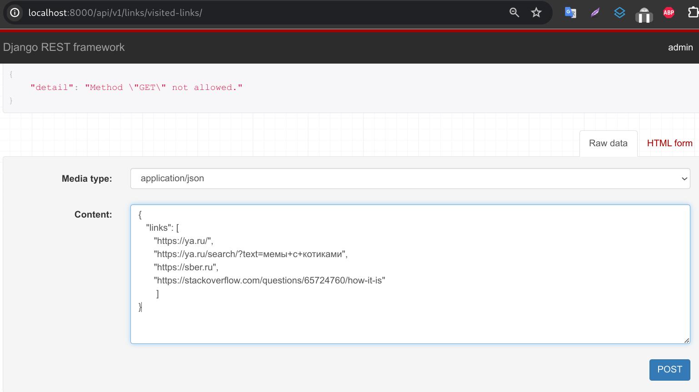
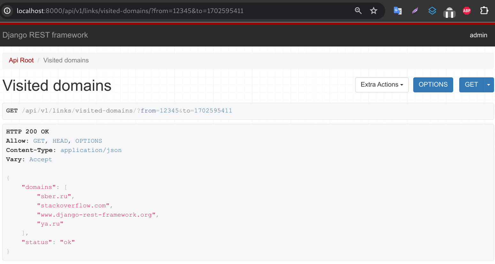

## За нами следят (Python)
Большие компании сильно обеспокоены на тему безопасности. Сбер не исключение, и он хочет знать, на какие ресурсы ходят его сотрудники.
Реализуйте wеb-сервис для простого учета посещенных ресурсов

## Технические требования
### Cервис должен уметь принимать список ссылок, которые были посещены работником
- время посещения ссылок/ки считается временем принятия запроса сервисом
- поле status служит для передачи любых возникающих ошибок при обработке запроса

### Сервис должен предоставлять полный список доменов посещенных работником
- список уникальных посещенных доменнов
- можно задавать временные интервалы через параметры запроса
- поле status служит для передачи любых возникающих ошибок при обработке запроса

## Установка
- склонируйте проект с реппозитория GitHub
    ```
    git clone https://github.com/AlexanderNkn/being_watched.git
    ```
- начальная настройка проекта происходит при запуске bash скрипта initial_setup.sh. При этом выполняются следующие действия:
    * создаются .env файлы с переменными окружения
    * собираются образы
    * создается база данных и в нее загружается схема
- для запуска initial_setup.sh нужно перейти в директорию, дать разрешение на запуск и исполнить
    ```
    cd being_watched && chmod +x initial_setup.sh && ./initial_setup.sh
    ```
- логин/пароль пользователя для тестов
    ```
    admin admin
    ```
- запустите проект
    ```
    docker-compose up -d
    ```

## Тестирование
- тесты запускаются автоматически при пулл реквесте
- локально
    ```
    python manage.py test
    ```

## Использование
- для добавления ссылок в базу данных отправте POST запрос на 
    ```
    /api/v1/links/visited-links/
    ```


- список посещенных доменов доступен по адресу
    ```
    /api/v1/links/visited-domains/
    ```
